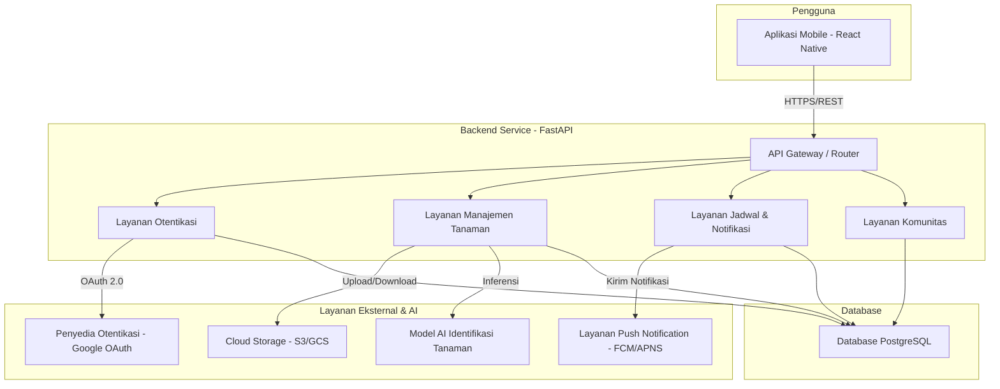

# Arsitektur Sistem: Tanam Rawat

**Versi:** 0.1 (Draf Awal)

Dokumen ini menguraikan arsitektur teknis tingkat tinggi untuk aplikasi "Tanam Rawat", berdasarkan `spesifikasi-produk.md`.

## 1. Diagram Arsitektur Umum

Diagram berikut menggambarkan komponen utama dan alur interaksi dalam sistem Tanam Rawat.

## 2. Deskripsi Komponen

### **Aplikasi Mobile (Frontend)**
- **Teknologi:** React Native.
- **Tanggung Jawab:**
    - Menyajikan antarmuka pengguna (UI) dan mengelola pengalaman pengguna (UX).
    - Mengambil input dari pengguna (foto, teks).
    - Berkomunikasi dengan Backend melalui REST API.
    - Mengelola state lokal (misalnya, data pengguna yang sedang login, jadwal yang sudah di-cache).
    - Menerima dan menampilkan push notification.

### **Backend Service (API)**
- **Teknologi:** Python dengan FastAPI.
- **Tanggung Jawab:**
    - **API Gateway:** Titik masuk tunggal untuk semua permintaan dari aplikasi mobile. Bertugas untuk routing, validasi, dan otentikasi awal.
    - **Layanan Otentikasi:** Mengelola pendaftaran dan login pengguna, berintegrasi dengan penyedia eksternal seperti Google.
    - **Layanan Manajemen Tanaman:** Mengelola data master tanaman, koleksi tanaman milik pengguna, dan berinteraksi dengan model AI untuk identifikasi.
    - **Layanan Jadwal & Notifikasi:** Membuat dan mengelola jadwal perawatan, serta memicu pengiriman notifikasi.
    - **Layanan Komunitas:** Mengelola fungsionalitas forum (postingan, komentar).

### **Database**
- **Teknologi:** PostgreSQL.
- **Struktur Data Utama (Tabel):**
    - `users`: Menyimpan data pengguna (ID, email, nama, token otentikasi).
    - `plants`: Database master tanaman (ID, nama ilmiah, nama lokal, deskripsi, panduan perawatan).
    - `user_collections`: Menghubungkan pengguna dengan tanaman yang mereka miliki (ID, user_id, plant_id, nama panggilan tanaman).
    - `schedules`: Menyimpan jadwal perawatan (ID, collection_id, tipe_perawatan, waktu, status).
    - `posts` & `comments`: Untuk fitur forum.

### **Layanan Eksternal & AI**
- **Model AI Identifikasi:** 
  - **Status Saat Ini:** Endpoint `/identify` mengembalikan respons dummy untuk validasi alur kerja
  - **Rencana Jangka Panjang:** Pengembangan model AI identifikasi tanaman internal dengan target akurasi >90% (lihat `ai_strategy.md`)
  - **Implementasi Berikutnya:** Upload gambar dari frontend dan respons simulasi yang lebih realistis
- **Cloud Storage:** 
  - **Status:** Belum diimplementasi
  - **Rencana:** Semua aset gambar (foto tanaman dari pengguna, gambar di ensiklopedia) akan disimpan di cloud untuk skalabilitas
- **Push Notification Service:** 
  - **Status:** Belum diimplementasi
  - **Rencana:** Firebase Cloud Messaging (FCM) untuk Android dan Apple Push Notification Service (APNS) untuk iOS

## 3. Alur Data Kunci

### Alur Identifikasi Tanaman

#### **Status Implementasi Saat Ini (Dummy/Simulasi):**
1. **Pengguna** menekan tombol "Identifikasi Tanaman" di **Aplikasi Mobile**
2. **Aplikasi Mobile** memanggil endpoint `/identify` di **Backend Service**
3. **Backend Service** mengembalikan respons dummy ("Tanaman sedang diproses")
4. **Aplikasi Mobile** menampilkan respons dummy kepada pengguna

#### **Target Implementasi Berikutnya (Upload Gambar + Simulasi):**
1. **Pengguna** mengambil foto melalui **Aplikasi Mobile**
2. **Aplikasi Mobile** mengirim gambar ke **Backend Service** (endpoint `/identify`)
3. **Backend Service** menyimpan gambar sementara dan mengembalikan nama tanaman simulasi
4. **Aplikasi Mobile** menampilkan hasil simulasi kepada pengguna

#### **Alur Final yang Direncanakan (AI Penuh):**
1. **Pengguna** mengambil foto melalui **Aplikasi Mobile**
2. **Aplikasi Mobile** mengirim gambar ke **Backend Service** (endpoint `/identify`)
3. **Backend Service** mengunggah gambar ke **Cloud Storage** dan mendapatkan URL
4. **Backend Service** mengirim URL gambar ke **Model AI Identifikasi**
5. **Model AI** mengembalikan hasil prediksi (nama tanaman dan skor kepercayaan)
6. **Backend Service** mencocokkan hasil dengan data di tabel `plants` dalam **Database PostgreSQL**
7. **Backend Service** mengembalikan informasi tanaman yang cocok ke **Aplikasi Mobile**
8. **Aplikasi Mobile** menampilkan hasilnya kepada pengguna

## 4. Pilihan Teknologi & Alasan

- **React Native:** Dipilih untuk pengembangan cross-platform yang efisien, memungkinkan kita menargetkan pengguna Android dan iOS dengan satu basis kode.
- **Python/FastAPI:** Ideal untuk pengembangan API yang cepat. Ekosistem Python yang matang sangat mendukung untuk integrasi dengan pustaka AI/ML di masa depan.
- **PostgreSQL:** Database relasional yang andal, kuat, dan cocok untuk data terstruktur seperti profil pengguna, jadwal, dan relasi antar data.
- **PaaS (Heroku/Vercel):** Mempercepat proses deployment dan manajemen infrastruktur, sehingga tim bisa fokus pada pengembangan fitur.

## 5. Pertimbangan Skalabilitas & Masa Depan

- **Model AI:** Arsitektur ini memungkinkan kita untuk beralih dari API eksternal ke model AI yang kita latih sendiri (*in-house*) di masa depan tanpa mengubah alur kerja aplikasi secara drastis. Cukup dengan mengganti komponen yang berinteraksi dengan model AI di backend.
- **Pemisahan Layanan:** Meskipun saat ini berjalan sebagai monolit, layanan di backend (Otentikasi, Tanaman, dll.) dirancang dengan batasan yang jelas. Ini memungkinkan potensi pemisahan menjadi *microservices* jika skala aplikasi membutuhkannya di masa depan.
- **Stateless API:** API dirancang untuk menjadi *stateless*, yang berarti setiap permintaan berisi semua informasi yang diperlukan untuk memprosesnya. Ini mempermudah proses *scaling* horizontal (menambah lebih banyak server) di masa depan.
